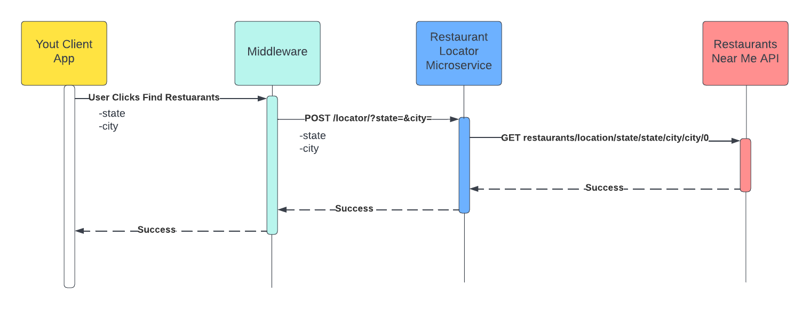

# Restaurant Locatator Microservice

This microservice will receive a city and state and return 10 random restaurants located in that city and state.

The application was created using Express Application Generator

`bin/www` contains the port the service runs on

`app.js` contains the routes and uses cors to run locally

`routes/locator.js` contains the handling for requests

It uses `package.json` defines run commands

## Install

    npm install

## Run the app

    npm start

# UML Diagram

# REST API

The REST API to the example app is described below.
Use .env file to store API_KEY

## Get list of Restaurants

### Request

`GET /locators?state={IA}&city={Des Moines}`

    await fetch('http://localhost:9000/locator?state=IA&city=Des Moines')

### Response

    HTTP/1.1 200 OK
    Date: Thu, 24 Feb 2011 12:36:30 GMT
    Status: 200 OK
    Connection: close
    Content-Type: application/json
    Content-Length: 2

    [
        {
          id: 19882607,
          restaurantName: "Clyde's Fine Diner",
          address: '111 E Grand Ave Suite 111',
          zipCode: '50309-1885',
          phone: '+1 515-243-3686',
          website: 'http://www.clydesfinediner.com/',
          email: '',
          latitude: '41.589603',
          longitude: '-93.61564',
          stateName: 'IA',
          cityName: 'Des Moines',
          hoursInterval: 'Tue - Sat (4:00 PM - 9:00 PM) | Thu - Sat (11:00 AM - 2:00 PM)',
          cuisineType: 'American'
        },
        {
          id: 836118,
          restaurantName: 'Dolly Madison',
          address: '3947 E 14th St',
          zipCode: '50313-3889',
          phone: '+1 515-265-6426',
          website: '',
          email: '',
          latitude: '41.63293',
          longitude: '-93.60013',
          stateName: 'IA',
          cityName: 'Des Moines',
          hoursInterval: '',
          cuisineType: 'Restaurant'
        },
        {
          id: 2248841,
          restaurantName: 'Pueblo Viejo',
          address: '3841 E 14th St',
          zipCode: '50313-3811',
          phone: '+1 515-265-1720',
          website: 'http://www.facebook.com/pages/Pueblo-Viejo/118075724878011',
          email: '',
          latitude: '41.631107',
          longitude: '-93.60007',
          stateName: 'IA',
          cityName: 'Des Moines',
          hoursInterval: '',
          cuisineType: 'Mexican'
        },
        {
          id: 10753171,
          restaurantName: "Paul Revere's Pizza",
          address: '3201 Indianola Ave',
          zipCode: '50315',
          phone: '+1 515-244-9256',
          website: 'https://www.paulreverespizzadm.com/',
          email: 'joanfromia@yahoo.com',
          latitude: '41.555126',
          longitude: '-93.59809',
          stateName: 'IA',
          cityName: 'Des Moines',
          hoursInterval: 'Sun - Sat (4:00 PM - 3:00 AM)',
          cuisineType: 'Restaurant'
        },
        {
          id: 12351084,
          restaurantName: 'Harbinger',
          address: '2724 Ingersoll Ave',
          zipCode: '50312-5240',
          phone: '+1 515-244-1314',
          website: 'http://Harbingerdsm.com',
          email: '',
          latitude: '41.58574',
          longitude: '-93.65436',
          stateName: 'IA',
          cityName: 'Des Moines',
          hoursInterval: '',
          cuisineType: 'Asian,American'
        },
        {
          id: 14982130,
          restaurantName: 'Players',
          address: '1760 Beaver Ave',
          zipCode: '50310-3812',
          phone: '+1 515-274-8639',
          website: 'https://www.facebook.com/Players-Sports-Bar-Grill-124322960959919/',
          email: '',
          latitude: '41.61021',
          longitude: '-93.67274',
          stateName: 'IA',
          cityName: 'Des Moines',
          hoursInterval: '',
          cuisineType: 'American'
        },
        {
          id: 12414118,
          restaurantName: 'Kathmandu Restaurant',
          address: '7225-7229 Apple Valley Drive Windsor Heights IA',
          zipCode: '50324-1729',
          phone: '+1 515-255-1270',
          website: 'http://www.kathmanduiowa.com/',
          email: '',
          latitude: '41.59934',
          longitude: '-93.71686',
          stateName: 'IA',
          cityName: 'Des Moines',
          hoursInterval: 'Sun - Thu (5:00 PM - 9:00 PM) | Sun - Sat (11:00 AM - 2:30 PM) | Fri - Sat (5:00 PM - 10:00 PM)',
          cuisineType: 'Indian,Nepali'
        },
        {
          id: 21267600,
          restaurantName: "Casey's",
          address: '4331 Park Ave',
          zipCode: '50321-3403',
          phone: '+1 515-244-4666',
          website: 'https://www.caseys.com/general-store/ia-desmoines/4331-park-ave/2322',
          email: '',
          latitude: '41.556038',
          longitude: '-93.676506',
          stateName: 'IA',
          cityName: 'Des Moines',
          hoursInterval: 'Sun - Sat (5:00 AM - 11:00 PM)',
          cuisineType: 'Restaurant'
        },
        {
          id: 15861167,
          restaurantName: 'Dairy Queen (Treat)',
          address: '5415 Douglas Ave',
          zipCode: '50310-1841',
          phone: '+1 515-278-1847',
          website: 'https://www.dairyqueen.com/us-en/Locator/Detail/',
          email: '',
          latitude: '41.629692',
          longitude: '-93.693504',
          stateName: 'IA',
          cityName: 'Des Moines',
          hoursInterval: 'Sun - Fri (12:00 PM - 9:00 PM) | Sat (11:00 AM - 9:00 PM)',
          cuisineType: 'Restaurant'
        },
        {
          id: 5013065,
          restaurantName: 'Beer Can Alley',
          address: '216 Court Ave',
          zipCode: '50309-2281',
          phone: '+1 515-554-2606',
          website: 'http://www.beercanalley.com/',
          email: '',
          latitude: '41.58506',
          longitude: '-93.61996',
          stateName: 'IA',
          cityName: 'Des Moines',
          hoursInterval: 'Sun - Wed (7:00 PM - 2:00 AM) | Thu - Sat (5:00 PM - 2:00 AM)',
          cuisineType: 'Restaurant'
        }
      ]

